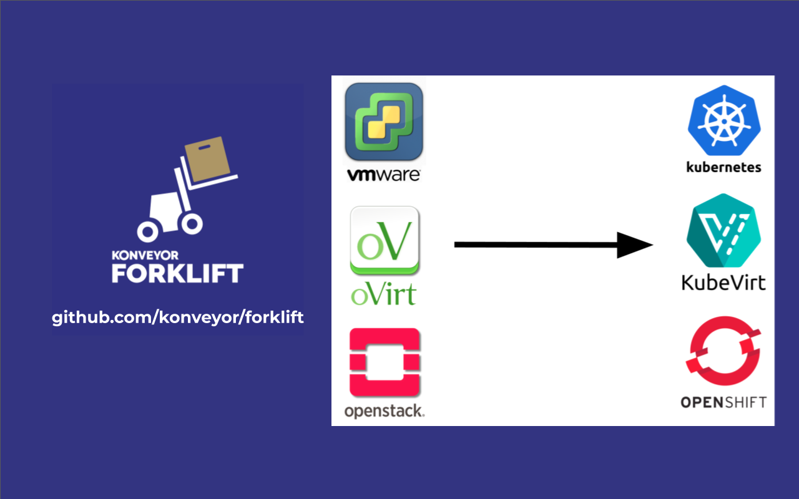
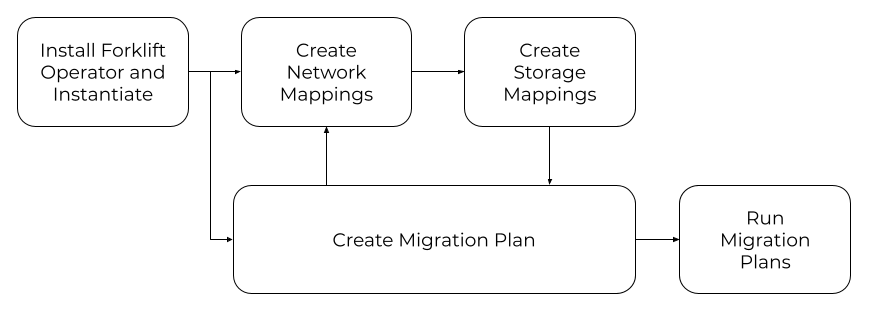

# Konveyor Forklift

## What is Forklift?

A tool that accelerates the process of re-hosting / re-platforming virtual machines to Kubernetes and KubeVirt. It does so by mapping resources (network and storage), creating equivalent resources in the target, and converting disk images.

Forklift is a tool that connects to VM source providers (currently VMware vSphere 6.x, planning to add Red Hat Virtualization / oVirt and OpenStack). Then using the same procedures and mechanisms as a backup tool, it streams and converts the contents to a Kubernetes + KubeVirt format. The source VMs are kept powered off, and the target VMs are started.

## A quick start with Forklift

Forklift is built and deployed using Kubernetes natives, therefore an operator is provided in order to deploy and mantain it.
Once it is deployed, it can be used through the UI or consumed via CLI or API. 

* Try the latest version of Forklift

Installing latest is almost an identical procedure to released versions but requires creating a new catalog source.

1. `oc create -f forklift-operator-catalog.yaml`
1. Follow the same procedure as released versions until the Search for _Konveyor Forklift Operator_ step.
1. There should be two _Konveyor Forklift Operator_ available for installation now.
1. Select the _Konveyor Forklift Operator_ without the _community_ tag.
1. Proceed to install latest.

**Note:** Installing _Latest_ will also include OLM channels for released versions.

More details in the [Operator README.md](https://github.com/konveyor/forklift-operator/blob/main/README.md) file.

* Install a released version of Forklift:

<iframe width="560" height="315" src="https://www.youtube.com/embed/a1mXGbOHzs4" title="YouTube video player" frameborder="0" allow="accelerometer; autoplay; clipboard-write; encrypted-media; gyroscope; picture-in-picture" allowfullscreen></iframe>

* Use Forklift. You can do so by adding a source VMware provider, establishing maps, and going to the migration plans:

<iframe width="560" height="315" src="https://www.youtube.com/embed/mY4mw6negQ4" title="YouTube video player" frameborder="0" allow="accelerometer; autoplay; clipboard-write; encrypted-media; gyroscope; picture-in-picture" allowfullscreen></iframe>

## Usage

Forklift takes as input the source provider VMs, and their resources (disks, networks, etc) and transforms them into resources in the target provider (Konveyor + KubeVirt)

If you want to take a look at the User Interface you may reach an interactive mockup in this [link](http://konveyor-forklift-ui-preview.surge.sh/)

* [Forklift documentation](https://forklift-docs.konveyor.io/)

## Discussion

To discuss with the maintainers, reach out in [slack](https://kubernetes.slack.com/archives/CR85S82A2) in [kubernetes](https://slack.k8s.io/) workspace or reach out to us in the [forum](https://groups.google.com/g/forklift-dev).

To see the current plans for the project take a look at the [Roadmap June 2021 Slides](https://github.com/konveyor/forklift/blob/main/roadmap/Konveyor_Forklift_Roadmap-June_2021.pdf)

Join us!
